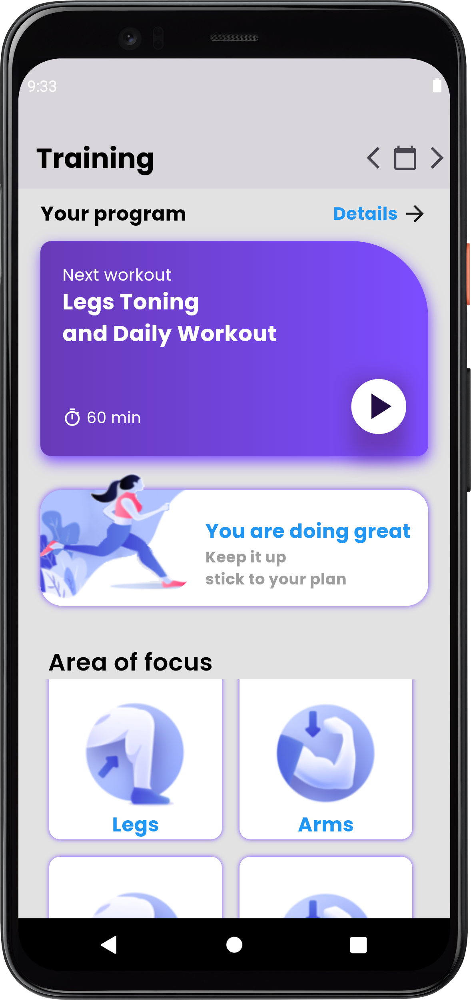
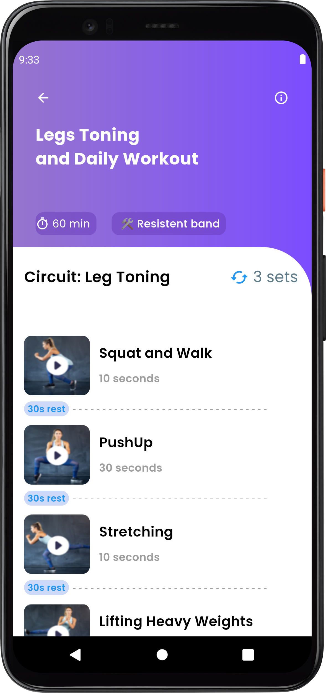
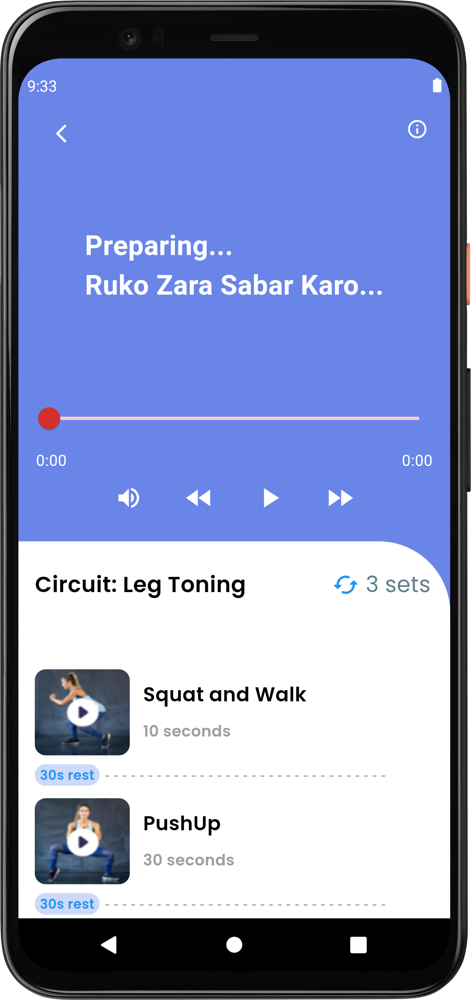
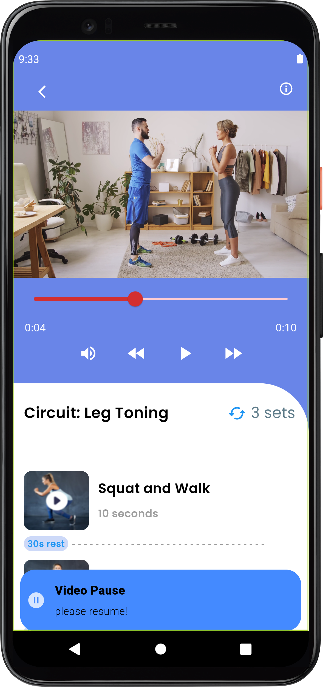
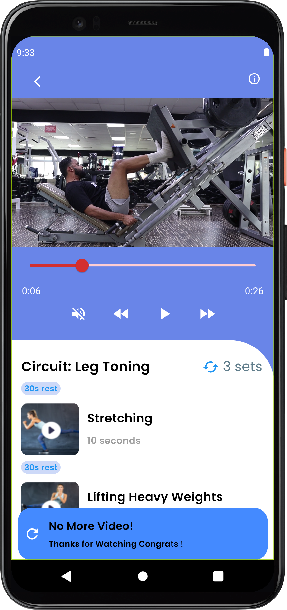

# **Daily Training App** 💪

A Flutter-based **Daily Training App** designed to help users stay consistent with their workout routines. The app features a dynamic interface with video demonstrations, timers, and personalized workout options.

---

## **Features** ✨
- 🏋️‍♂️ **Workout Routines**: Explore a variety of daily training plans with video tutorials.
- 🎥 **Video Player**: Integrated video playback for each exercise with custom controls.
- ⏳ **Timers**: Rest and exercise timers to keep your workouts on track.
- 🌟 **User-Friendly UI**: Clean, responsive, and interactive interface.

---

## **Screenshots** 📸

| **Workout Lessons**            | **Exercise View List**            | **Videos**            |
|-----------------------------|-----------------------------|---------------------------|
|  |  |  
|  |  |

---

## **Demo Video** 🎥  

  

---

## **Technologies Used** 🛠️
- **Flutter**: Framework for building the app.
- **Dart**: Programming language.
- **Video_Player Plugin**: For video playback functionality.
- **GetX**: For state management.
- **ScreenUtil**: For Responsive UI.

---

## **License** 📜
This project is licensed under the MIT License.
